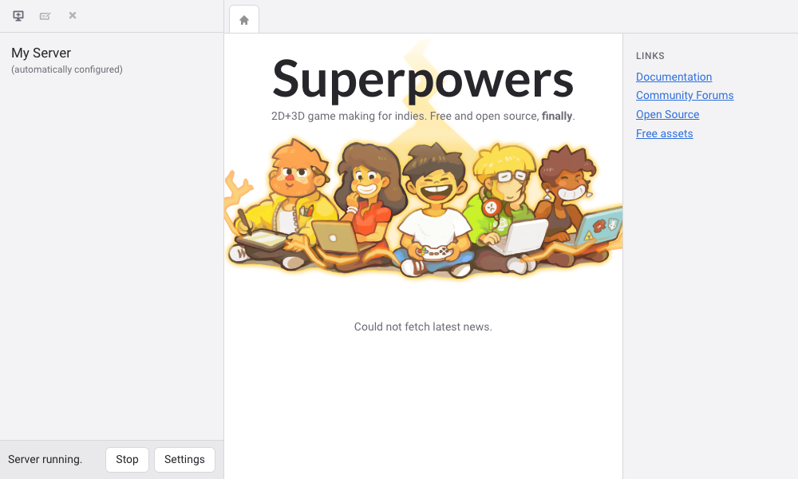
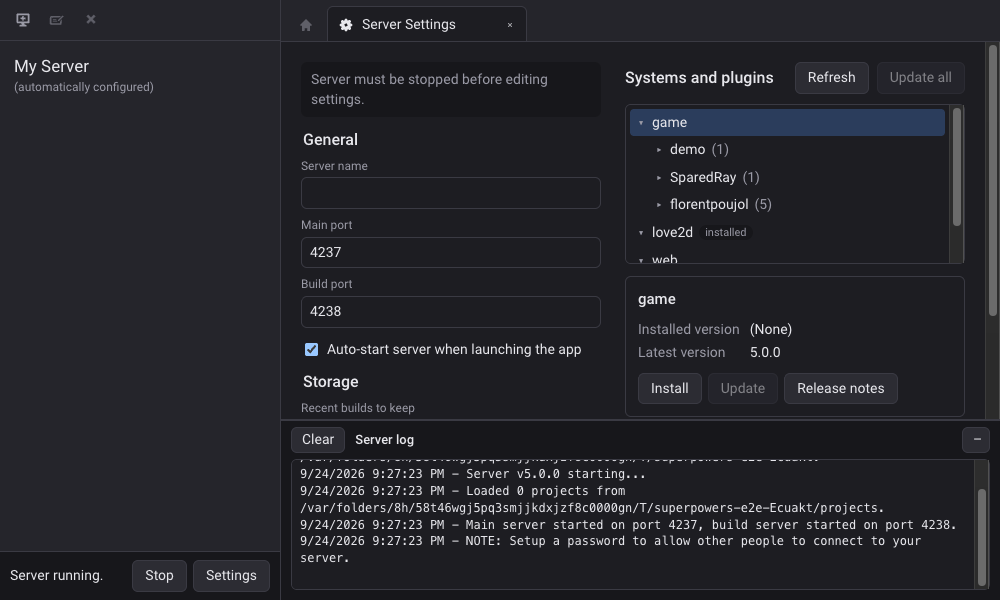
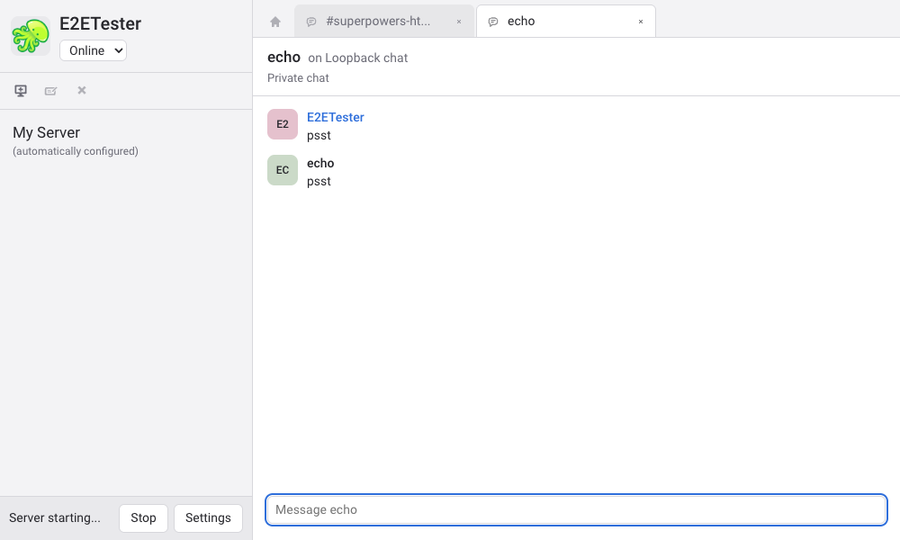
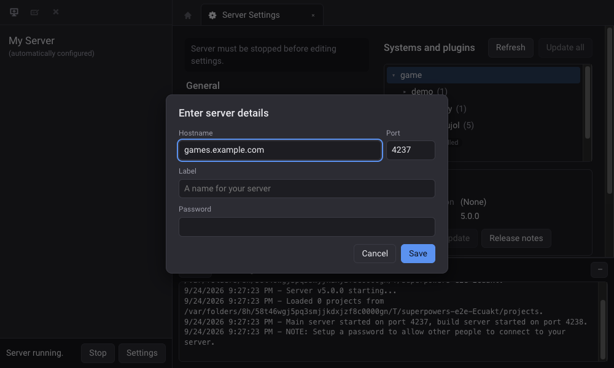

## Desktop app for Superpowers

[](https://github.com/superpowers/superpowers-app/blob/master/LICENSE.txt)
[](https://gitter.im/superpowers/dev)  
[](https://www.patreon.com/SparklinLabs)
[](https://twitter.com/SuperpowersDev)

[Website](http://superpowers-html5.com/) —
[Main repository](https://github.com/superpowers/superpowers-core) —
[How to contribute](http://docs.superpowers-html5.com/en/development/how-to-contribute) —
[Build instructions](http://docs.superpowers-html5.com/en/development/building-superpowers)

| Light                                                         | Dark                                                          |
| ------------------------------------------------------------- | ------------------------------------------------------------- |
|                       |  |
|  |       |

## Development

Requires Node.js 24+.

```sh
npm install
npm run dev        # launch with hot reloading of the UI; core & data live in ./.dev-core
npm run lint
npm run typecheck
npm test           # unit tests (Vitest)
npm run build && npx playwright test   # end-to-end smoke test
npm run package    # installers for the current platform, in ./dist
```

Project layout:

- `src/main/`: Electron main process. Owns everything that touches the system: settings, the local
  server and other core processes, core installs & updates, the chat backend and file authorizations
- `src/preload/app.ts`: exposes the channels declared in `src/shared/ipc-contract.ts` to the launcher UI,
  which runs sandboxed with no Node.js access
- `src/preload/supapp.ts`: the `SupApp` API injected into server & project webviews ([compatibility notes](docs/supapp-compat.md))
- `src/renderer/`: launcher UI (Svelte 5). State lives in `lib/*.svelte.ts` modules; `views/` and
  `components/` render it. Pure logic (chat formatting, chat state, tabs) has unit tests next to it
- `src/shared/`: types and code shared between processes
- `resources/`: icons and locales

With `--core-path=<folder>` (as `npm run dev` does), all data lives in that folder, including
Electron's profile in `<folder>/.electron-profile`.

### Chat

The launcher has a chat UI (channels, private messages, presence) that talks to a pluggable
backend in the main process: see `ChatBackend` in `src/main/chat/backend.ts`. No backend ships
yet, so the chat UI is hidden by default. `SUPERPOWERS_CHAT_BACKEND=loopback npm run dev` enables
a local stand-in (`src/main/chat/loopback.ts`) for working on the UI; the end-to-end tests use it too.
